# Radio-Manager

Приложение для редактирования плейлистов


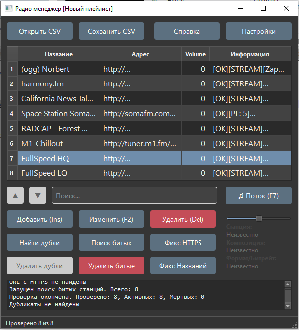


---
Возможности программы:
- Проверка файла CSV при открытии, устранение проблем синтаксиса. 
- Многопоточная проверка станций на существование 
- Сбор информации о станциях (название, контейнер, качество потока). 
- Удаление неактивных станций. 
- Массовое переименование станций по шаблонам. 
- Живой поиск станций по имени, адресу, или информации. 
- Поиск и удаление дубликатов станций по адресам. 
- Массовое переименование протоколов (https->http). 
- Редактирование станции через окно редактора, или по щелчку на ячейку таблицы. 
- Сортировка плейлиста мышью. 
- Интерактивный обмен станциями между плейлистами (копиями программы). 
- Прослушивание потоков в приложении. 
- Светлая и темная тема оформления. 
- Сохранение плейлиста в формате CSV для ёрадио. 
---

# Справка


- [Запуск](#запуск)
- [Настройки](#настройки)
- [Исправление плейлиста](#исправление-плейлиста)
- [Удаление дубликатов](#удаление-дубликатов)
- [Проверка станций](#проверка-станций)
- [Массовое переименование](#массовое-переименование)
- [Сортировка плейлиста](#сортировка-плейлиста)
- [Редактирование плейлиста](#редактирование-плейлиста)
- [Обмен станциями между плейлистами](#обмен-между-плейлистами)
- [Плеер](#плеер)
- [Поиск](#поиск)
- [От автора](#от-автора)
---

## Запуск

### Вариант 1: Использование готового исполняемого файла (Windows)

1. Скачайте последний релиз из раздела [Releases](https://github.com/leowerd/radio-manager/releases)
2. Распакуйте архив в любую папку  
3. Запустите `radio-manager.exe`

### Вариант 2: Запуск из исходного кода

1. Установите Python 3.8+ с [python.org](https://www.python.org/downloads/)

2. Клонируйте репозиторий или скачайте исходный код:
   ```bash
   git clone https://github.com/leowerd/radio-manager.git
   cd radio-manager

3. Установите зависимости:
    ```bash
    pip install PyQt6 requests charset-normalizer

4. Запустите приложение:
    ```bash
    python radio-manager.py   

---

## Настройки

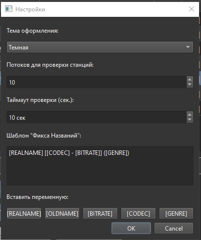

- В настройках можно выбрать тему оформления.  

- Количество потоков при проверке станций, 1-50, по-умолчанию 10.  
Каждая станция проверяется независимо от других в отдельном потоке.  
Большее количество потоков ускорит массовую проверку, но даст нагрузку на процессор и интернет канал.  

- Таймаут проверки, означает сколько времени программа будет ожидать ответа от сервера, прежде чем посчитает его мертвым и освободит поток для следующего сервера  

- Шаблон позволяет настроить массовое переименование, разрешены буквы, цифры и читаемые символы  
К примеру шаблон **[REALNAME] [[CODEC] - [BITRATE]] ([GENRE])**  
Будет выглядеть так: **Radio Record [AAC - 128] (Rock)**  

**Но учитывайте, что большинство станций отдают некорректные мета-теги, либо вовсе не отдают, поэтому перед заменой имени проверьте это в строке информации.**  

---

## Исправление плейлиста

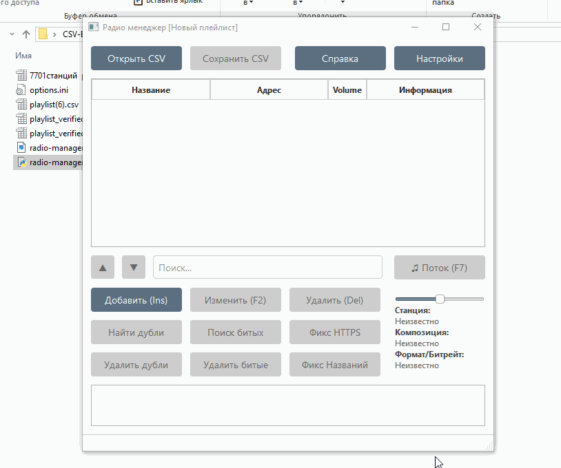

- При открытии плейлиста программа автоматически сканирует строки на валидность, прежде чем добавить их в таблицу.  
Поэтому открытие больших плейлистов может занять какое-то время (протестирован плейлист на **100160 записей**)  
- Если будут какие-то ошибки в строках, программа попробует их исправить и выдаст сообщение в лог.  
- При сохранении файла соблюдается очередность в списке.  
Если ваш плейлист некорректно определяется в ёрадио, достаточно просто открыть его в программе и сохранить, всё будет исправлено.  

---

## Удаление дубликатов

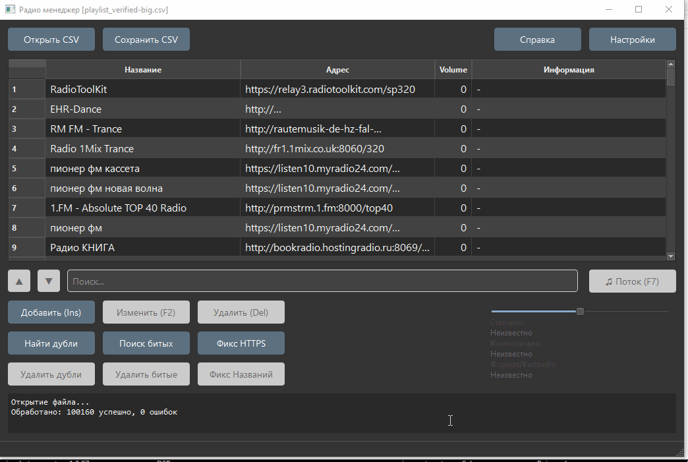

- Функция поиска дубликатов ищет станции с одинаковыми адресами, помечает тегом **[DOUBLE]**, что позволяет перемещаться между дублями с помощью кнопок поиска.  
- Кнопка "Удалить дубли" удаляет из плейлиста все строки с тегом **[DOUBLE]**.  
Для штучного удаления строк используйте кнопку **"Удалить (DEL)"**  
Рекомендуется убирать дубликаты в новых неизвестных плейлистах, для экономии времени.  

---

## Проверка станций

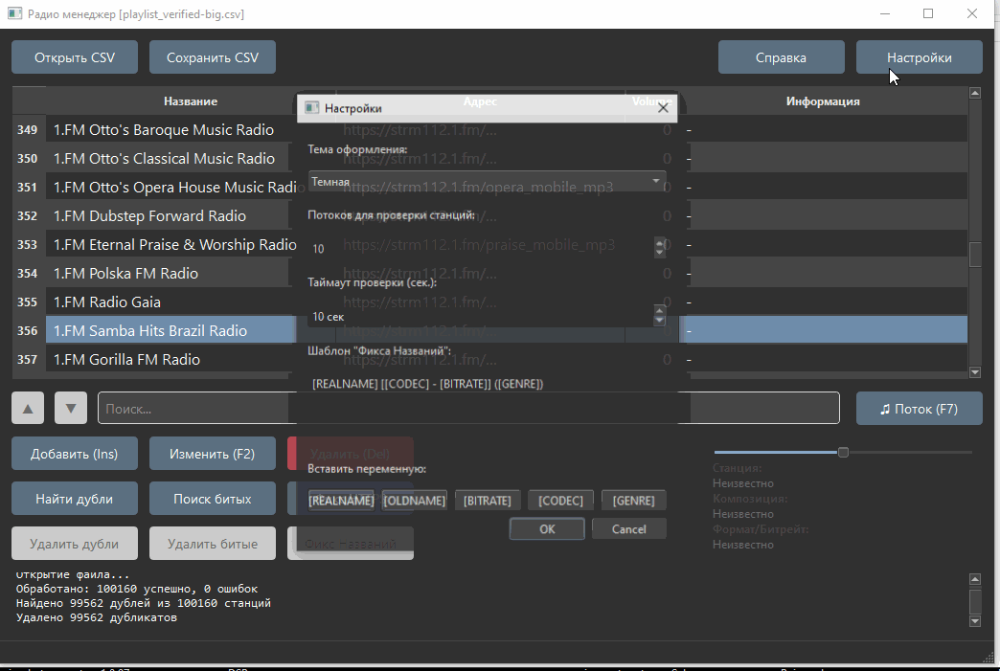

- Функция **"Поиск битых"** сканирует в многопоточном режиме все станции из таблицы.  
Если сервер отвечает ошибкой или заглушкой, то станции устанавливается соответствующий тег.  
- Кнопка **"Удалить битые"** позволяет массово удалить из плейлиста все мертвые станции.  
Перед удалением выйдет сообщение, где можно выбрать теги, подходящие под критерий (по-умолчанию выбраны все)  

- Так-же во время сканирования запрашивается информация о потоке и сохраняется в таблице для последующей работы.  
Формат **[OK][Тип данных][Название станции][кодек][битрейт][жанр]**  
Тип данных может быть **STREAM** (стрим) или **PL:N** (плейлист:количество потоков внутри) 

---

## Массовое переименование

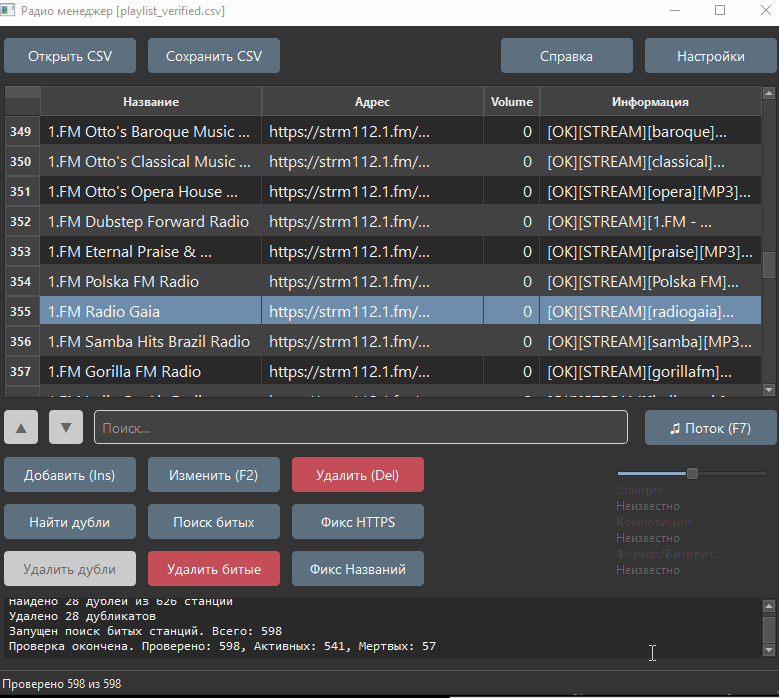  

- После проверки станций станет доступна функция массового переименования **"Фикс Названий"**.  
Позволяет обработать по шаблону весь плейлист, или выделенную строку.  
- Шаблон можно изменить и сохранить в настройках, но перед переименованием можно внести в него правку в всплывающем окне.  
**[REALNAME]** - Имя станции, полученое при сканировании  
**[OLDNAME]** - Имя станции, хранящееся сейчас в таблице.  
**[CODEC]** - Кодек потока, полученый при сканировании  
**[BITRATE]** - Битрейт потока  
**[GENRE]** - Жанр станции

**Помните, что не все станции корректно отдают метаданные, проверяйте в информации, прежде чем массово переименовать плейлист!**  


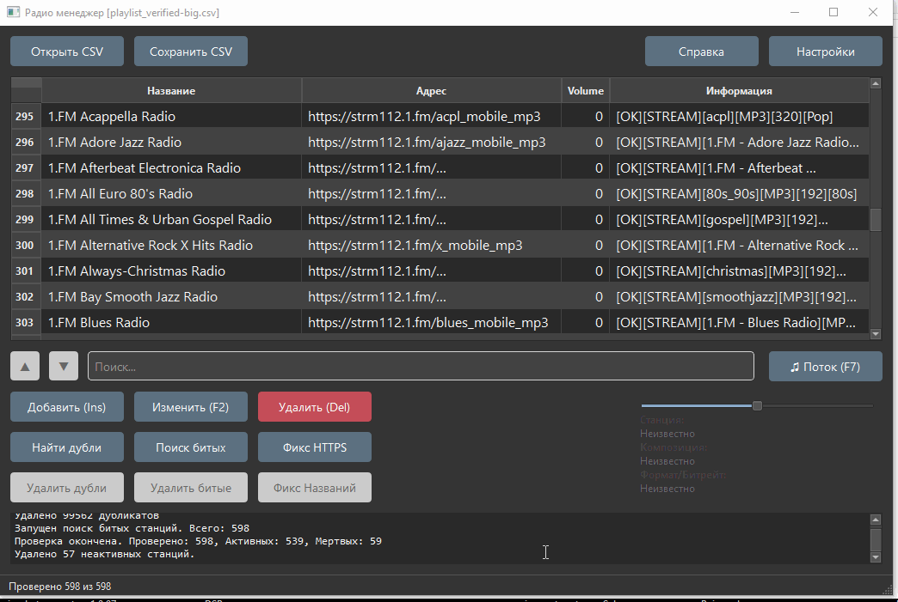

- Функция "Фикс HTTPS" массово переименовывает протокол в ссылках станций на HTTP, это требуется для радиоприемников без поддержки ssl
Для некоторых прошивок актуально.

---

## Сортировка плейлиста

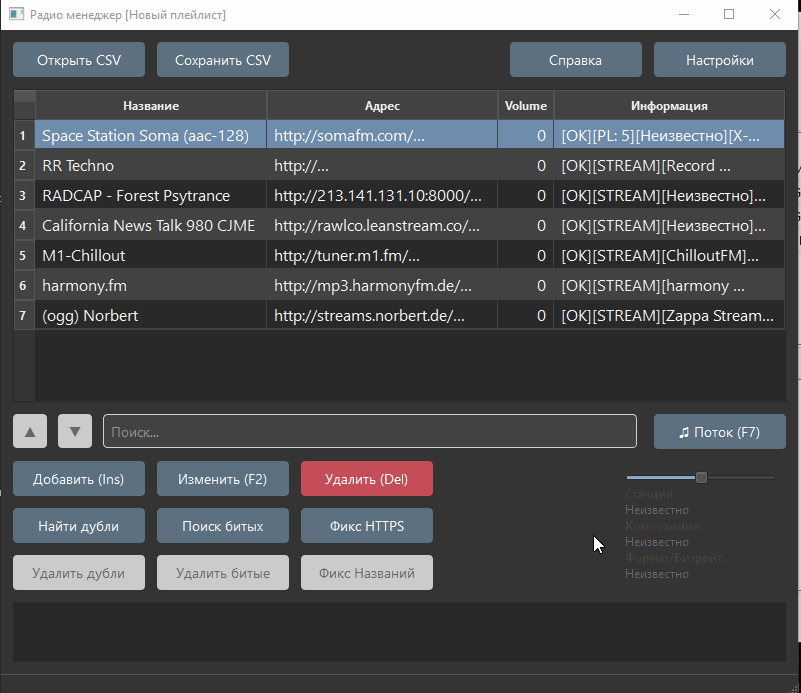

- Для того, чтобы сменить позицию строки в списке, достаточно ухватиться за левую часть нужной строки и перенести мышью в нужное место 

---

## Редактирование плейлиста

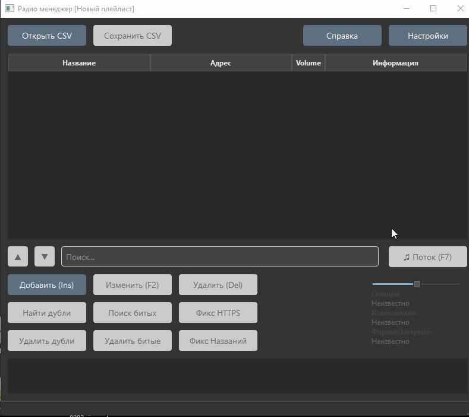

- Для ручного редактирования есть три кнопки с привязанными горячими клавишами.  
**"Добавить (Ins)"** - Добавляет строку в список станций, если выделить другую строку, то новая добавится под ней.  
**"Изменить (F2)"** - Открывает карточку станции выделенной строки, где можно изменить название, адрес и корректировку громкости.  
**"Удалить (Del)"** - Удаляет выделенную строку.  
- Изменить любую станцию можно так-же и в самой таблице. Щелкнув мышью по нужной ячейке, можно отредактировать в ней текст.  

---

## Обмен между плейлистами

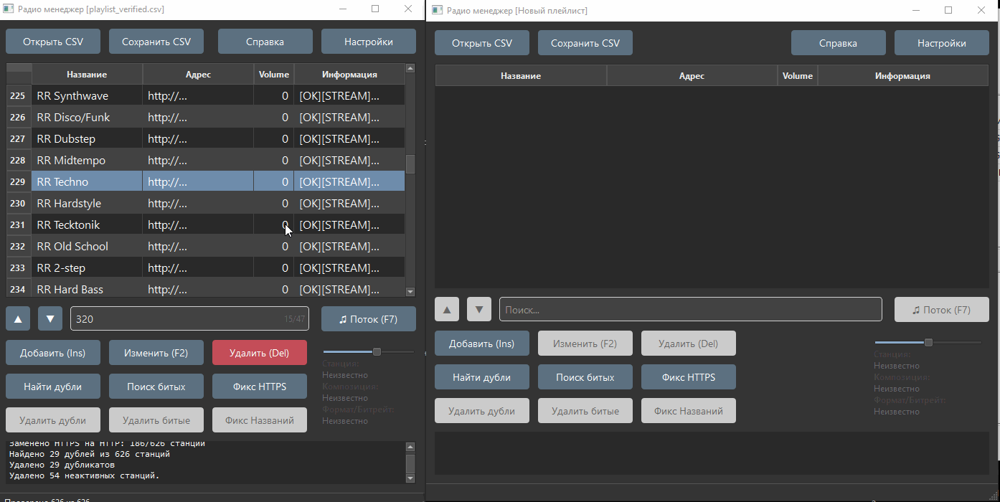

- Программа поддерживает обмен станциями между своими копиями.  
Можно открыть несколько разных плейлистов и навести порядок, либо составить из них новый.  
Для обмена достаточно ухватиться мышью за станцию в одной программе и перенести станцию в другую программу.  

---

## Плеер

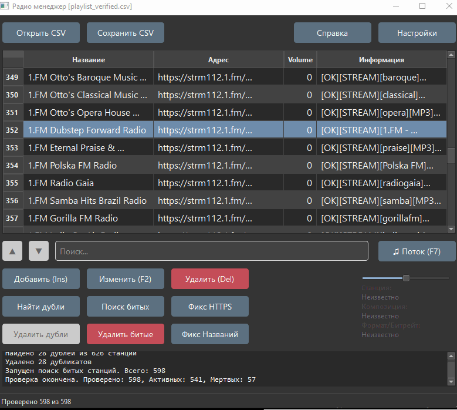

- Чтобы прослушать поток, нужно выделить станцию в плейлисте и нажать кнопку плеера, либо клавишу **F7**.  
- Повторное нажатие кнопки на этой же станции остановит прослушивание.  
Нажатие на другой станции просто переключит воспроизведение на новый поток.  

---

## Поиск

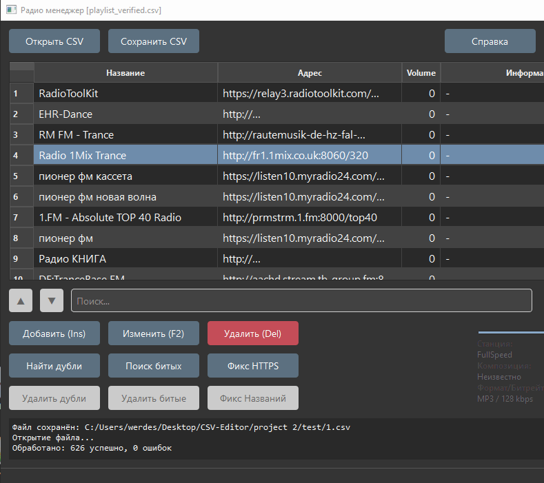  

- Функция живого поиска позволяет видеть результат во время ввода символов в текстовое поле.  
Если буддут найдены совпадения, то подходящие станции пометятся цветом, и первый результат будет активным выбранным.  
- Перемещаться между результатами поиска можно с помощью кнопок навигации.  

Поиск работает в ячейках Название, Адрес и Информация  

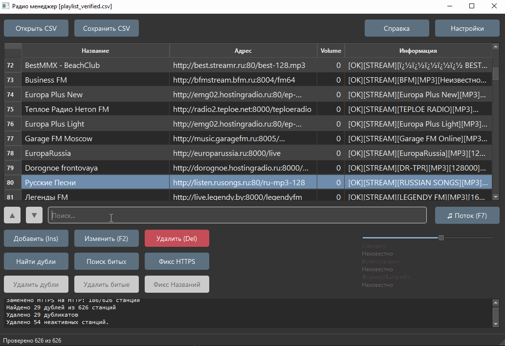  

Если ранее было произведено сканирование, то с помощью поиска можно находить станции отвечающие определенным критериям (формат, битрейт, жанр)


---


## От автора

Собрал для вас в одну кучу то, что лежало у меня отдельными кусками.  
Сейчас в этом приложении много багов и выглядит внутри оно как адовая смесь.  
Но если будет востребовано, то приберу и доведу со временем до ума) 

Если вы слушаете электронную музыку, то у меня есть интернет радио: https://radio.werdes.ru  
Сейчас там только drum and bass, но в планах добавить направлений.  
@werdes

---
  
  
  
  
  
  
    
